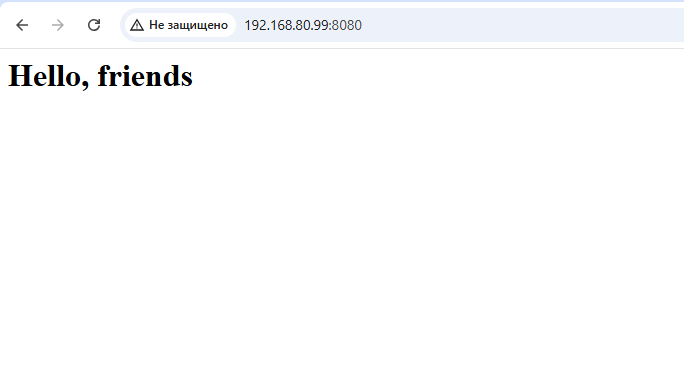

# Лабораторная работа "Docker".

В данной работе используется виртуальный хост под управлением ОС Ubuntu 22.04.2
## Задание
- Установите Docker на хост машину
- Установите Docker Compose - как плагин, или как отдельное приложение
- Создайте свой кастомный образ nginx на базе alpine. После запуска nginx должен отдавать кастомную страницу (достаточно изменить дефолтную страницу nginx)
- Определите разницу между контейнером и образом
- Ответьте на вопрос: Можно ли в контейнере собрать ядро?
- Собранный образ необходимо запушить в docker hub и дать ссылку на ваш репозиторий.

После успешной установки Docker на хост машину был собран образ nginx на базе alpine. 
Результат запуска:
    

Разница между контейнером и образом:
- образ - это статичная сущность, состоящая из набора слоев, содержит в себе все необходимое для работы приложения, собирается благодаря инструкциям, написанным в Dockerfile;
- rонтейнер – это экземпляр образа, который запускается и работает в изолированной среде. Контейнеры создаются на основе образов и представляют собой исполняемые экземпляры этих образов.

Можно ли в контейнере собрать ядро?
Собрать ядро в контейнере реально.

Ссылка на репозиторий:
https://hub.docker.com/repository/docker/skdm30/skdm30/general

