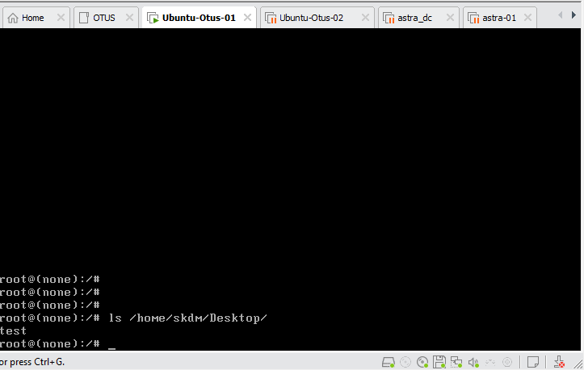

# Лабораторная работа "Загрузка системы".

В данной работе используется виртуальный хост под управлением ОС Ubuntu 22.04.2
## Задание
- Включить отображение меню Grub.
- Попасть в систему без пароля несколькими способами.
- Установить систему с LVM, после чего переименовать VG.


Для отображения меню Grub необходимо отредактировать конфигурационный файл 
```
/etc/default/grub
```

  

После редактирования необходимо произвести обновление grub и перезагрузить хость
```
update-grub
```
В итоге видим меню

  

Чтобы попасть в систему без пароля во время отображения меню Grub необходимо нажать клавишу "е" и изменить параметры загрузки:
в конце строки, начинающейся с linux, указываем rw и добавляем init=/bin/bash, далее сtrl-x для загрузки в систему

  

Для проверки создадим файл "test" в домашнем каталоге пользователя "skdm"

 

А после перезагрузки проверим наличие этого файла в указанном каталоге

  

Также попасть в систему без пароля можно через "recovery mode"

  


