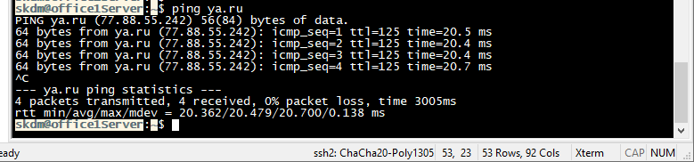

# Лабораторная работа "Архитектура сетей".

В данной работе используется виртуальные хост под управлением ОС Ubuntu 22.04.2
Vagrant не использовался. Виртуальные машины были развернуты средствами VMWare.
## Цель домашнего задания
Научится менять базовые сетевые настройки в Linux-based системах.

## Описание домашнего задания
Необходимо развернуть следующую сетевую архитектуру:
Сеть office1
- 192.168.2.0/26      - dev
- 192.168.2.64/26     - test servers
- 192.168.2.128/26    - managers
- 192.168.2.192/26    - office hardware

Сеть office2
- 192.168.1.0/25      - dev
- 192.168.1.128/26    - test servers
- 192.168.1.192/26    - office hardware

Сеть central
- 192.168.0.0/28     - directors
- 192.168.0.32/28    - office hardware
- 192.168.0.64/26    - wifi

    

## Ход работы
### Теоретическая часть
В теоретической части нам необходимо продумать топологию сети, а также:
-	Найти свободные подсети  
-	Посчитать количество узлов в каждой подсети, включая свободные
-	Указать Broadcast-адрес для каждой подсети
-	Проверить, нет ли ошибок при разбиении

| Network IPv4     |  Description              | Кол-во хостов |   Broadcast   |
|-----------------:|:-------------------------:|:--------------|---------------|
| 192.168.0.0/28   |  Directors                |      14       | 192.168.0.15  |
| 192.168.0.16/28  |  Свободная сеть           |      14       | 192.168.0.31  |
| 192.168.0.32/28  |  Office hardware          |      14       | 192.168.0.47  |
| 192.168.0.48/28  |  Свободная сеть           |      14       | 192.168.0.63  |
| 192.168.0.64/26  |  Office hardware          |      62       | 192.168.0.127 |
| 192.168.0.128/25 |  Свободная сеть           |      126      | 192.168.0.255 |
| 192.168.1.0/25   |  dev                      |      126      | 192.168.1.127 |
| 192.168.1.128/26 |  Test Servers             |      62       | 192.168.1.191 |
| 192.168.1.192/26 |  Office hardware          |      62       | 192.168.1.255 |
| 192.168.2.0/26   |  dev                      |      62       | 192.168.2.63  |
| 192.168.2.64/28  |  Test Servers             |      14       | 192.168.2.79  |
| 192.168.2.80/26  |  Свободная сеть           |      62       | 192.168.2.127 |
| 192.168.2.128/26 |  Managers                 |      62       | 192.168.2.191 |
| 192.168.2.192/26 |  Office hardware          |      62       | 192.168.2.255 |

### Теоретическая часть
В практической части необходимо обеспечетить сетевую связность между всеми серверами и роутерами, а также выход в интернет через **InetRouter**
В ходе работы были настройены IP адреса в соответствии с заданием. В работе я их настраивал с помощью **netplan**, тут же были настроены маршруты по умолчанию и статические маршруты.
Приведу пример настройки */etc/netplan/01-network-manager-all.yaml*
```
network:
  version: 2
  renderer: NetworkManager
  ethernets:
    ens33:
      dhcp4: false
      addresses: [192.168.0.1/28]
      nameservers:
        addresses:
          - 8.8.8.8
    ens34:
      dhcp4: false
      addresses: [192.168.255.2/30]
      nameservers:
        addresses:
          - 8.8.8.8
      routes:
        - to: default
          via: 192.168.255.1
    ens41:
      dhcp4: false
      addresses: [192.168.255.5/30]
      nameservers:
        addresses:
          - 8.8.8.8
      routes:
        - to: 192.168.1.0/25
          via: 192.168.255.6       
    ens39:
      dhcp4: false
      addresses: [192.168.255.9/30]
      nameservers:
        addresses:
          - 8.8.8.8
      routes:
        - to: 192.168.2.128/26
          via: 192.168.255.10
```
В результате работы поставленные цели были выполнены. Это можно наблюдать на скриншотах:
- Вывод результата команды *ip route* на ***InetRouter***


- Доступ в интернет с ***centralServer***


- Доступ в интернет с ***office1Server***


- Доступ в интернет с ***office2Server***


- Сетевая связность ***centralServer*** с остальными серверами
 

- Сетевая связность ***centralServer*** с остальными серверами


- Сетевая связность ***centralServer*** с остальными серверами


