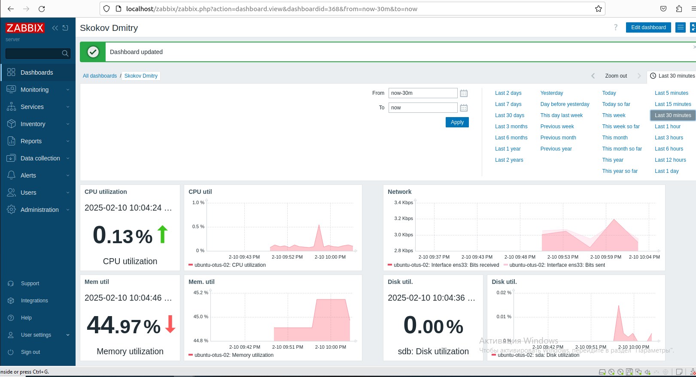

# Лабораторная работа "Мониторинг".

В данной работе используется виртуальный хост под управлением ОС Ubuntu 22.04.2
## Задание
Настроить дашборд с 4-мя графиками
- память
- процессор
- диск
- сеть
  
### Ход работы

На хосте был развернут zabbix-сервер и настроены необходимые дашборды.

  

